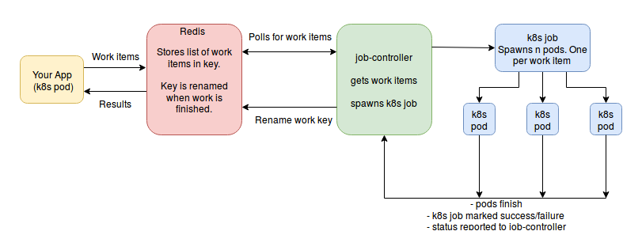

# job-controller

golang package providing an easy way to programmatically spawn and keep track
of kubernetes jobs within its own cluster.

## Diagram

## Acknowledgements

* [Multi-stage docker build to keep golang docker image size down](https://medium.com/@chemidy/create-the-smallest-and-secured-golang-docker-image-based-on-scratch-4752223b7324)

* [k8s cluster role binding to allow the default serviceaccount to create jobs](https://github.com/fabric8io/fabric8/issues/6840)

* [dtan4's k8s-job-cleaner](https://github.com/dtan4/k8s-job-cleaner) for its
  examples of using client-go.

* [NVIDIA's implementation of seeing if k8s jobs are finished](https://github.com/NVIDIA/kubernetes/blob/master/pkg/controller/job/utils.go)
